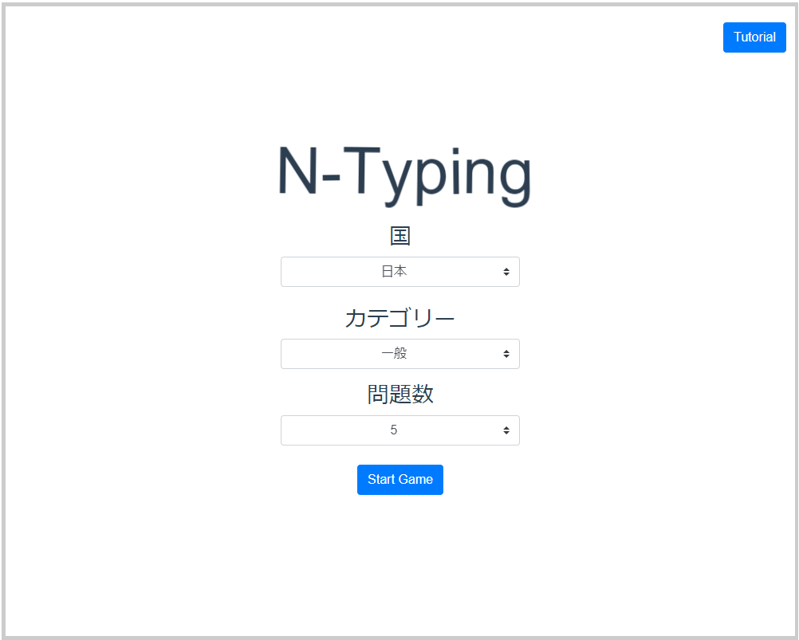

# サンプル（プロダクト名）

## 製品概要
### デプロイ先
https://news-typing-scla.herokuapp.com/
### 背景(製品開発のきっかけ、課題等）
- 情報教育が発展し，将来子供がパソコンに触れる機会が増える
- ニュースを見ない若者の増加
### 製品説明（具体的な製品の説明）
ニュースの見出しをタイピングするゲーム 
タイピングから世の中を知るきっかけになることを目的としたサービス
### 特長
#### 1. スキルの上達と社会について目を向けるきっかけ作りが同時にできる
#### 2. 途中まで読んだマンガの続きを読みたくなるように，ニュースに興味が出る仕組み

### 解決出来ること
ニュースに対する興味の向上
タイピングスキルの向上
### 今後の展望
シェア機能やスコアの記録を追加することでゲーム性を向上し，より多くのニュース記事が目に付くようにしたい．
### 注力したこと（こだわり等）
* 特殊な記号引くことで快適なタイピング環境を提供

## 開発技術
### 活用した技術
#### API・データ
* gooラボAPI:ひらがな化API
* NewsAPI

#### フレームワーク・ライブラリ・モジュール
* vue
* bootstrap
* Heroku
* GO
* Docker

#### デバイス
* パソコン

### 独自技術
#### ハッカソンで開発した独自機能・技術
* GOを利用したAPIサーバ
* ニュースを所得して成形するAPI
* 特に力を入れた部分をファイルリンク、またはcommit_idを記載してください。
